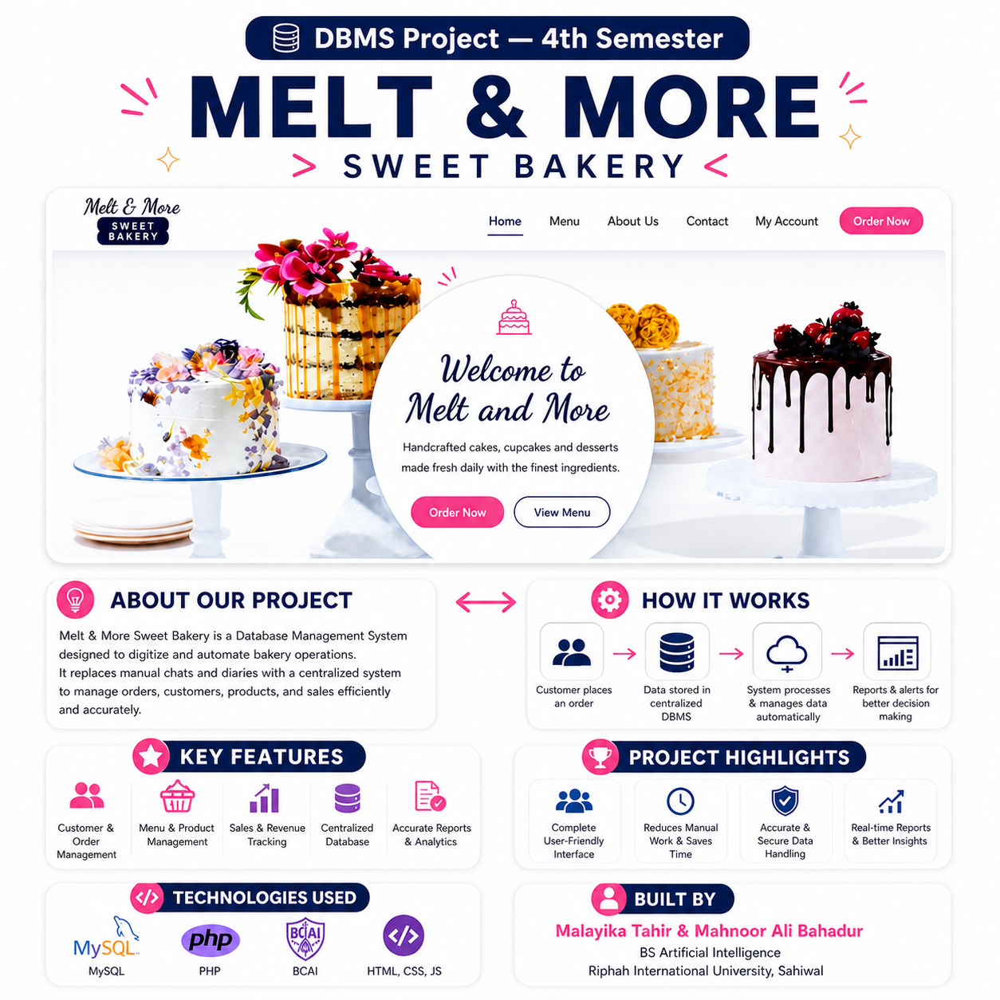
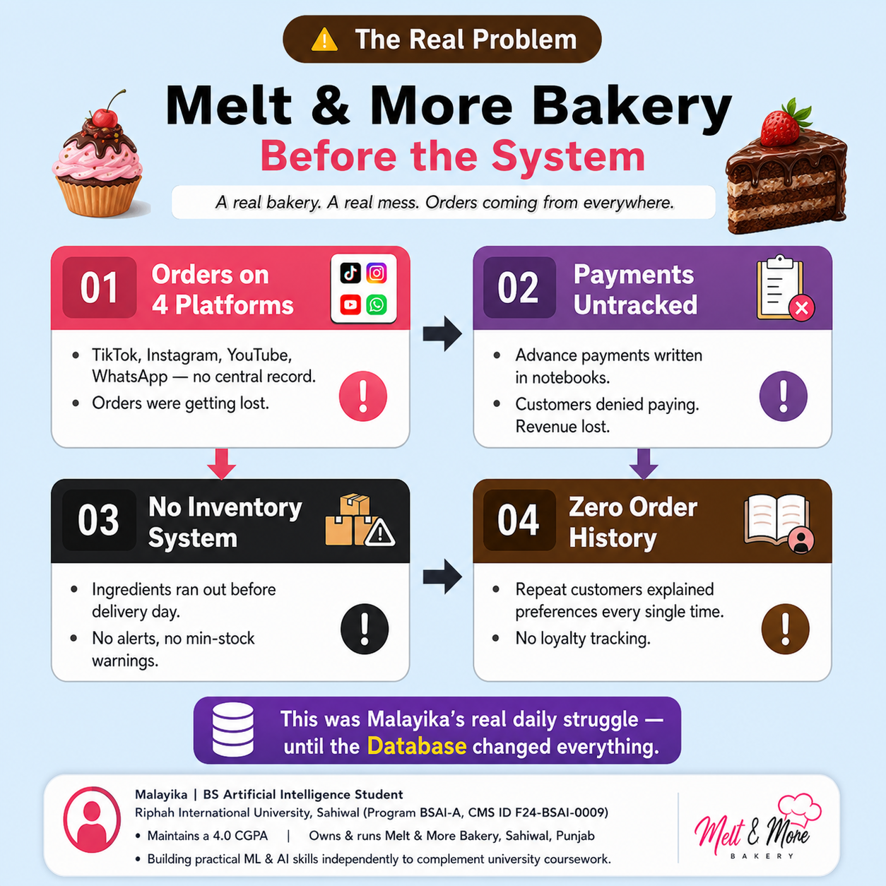
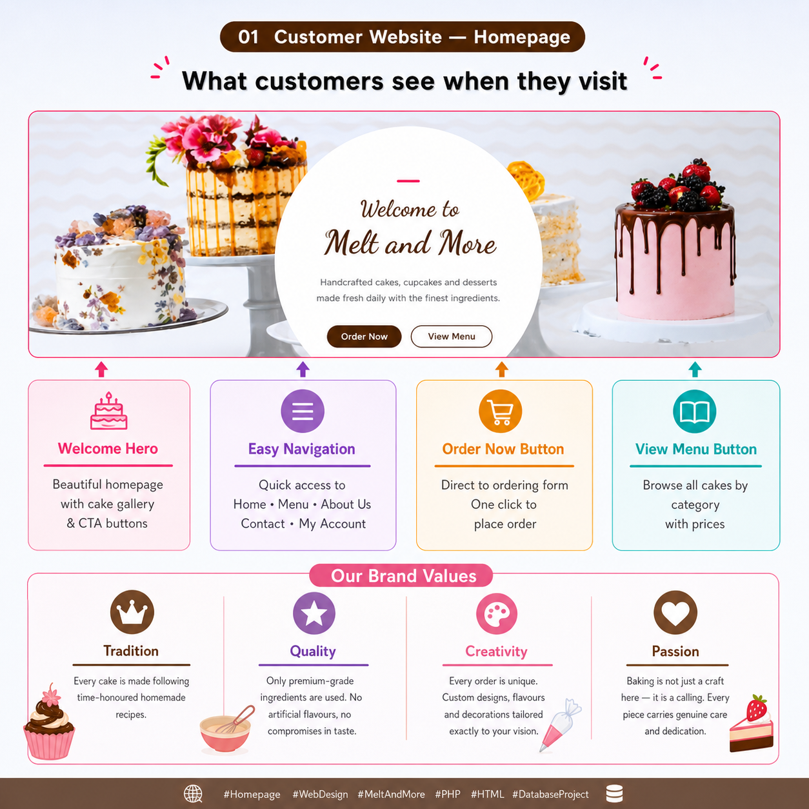
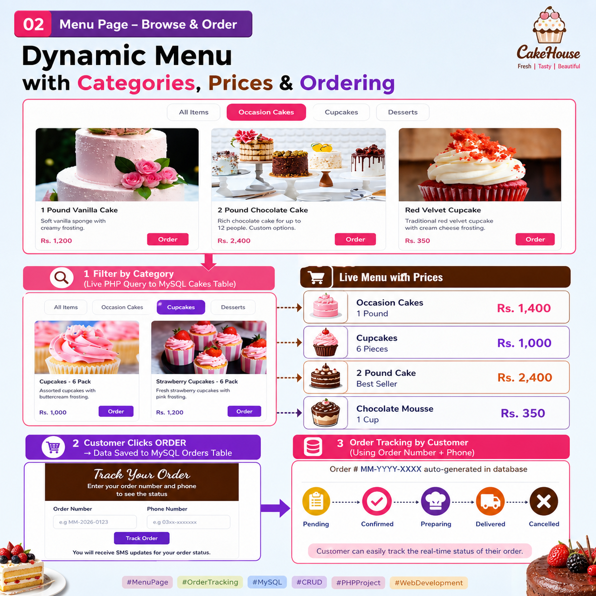
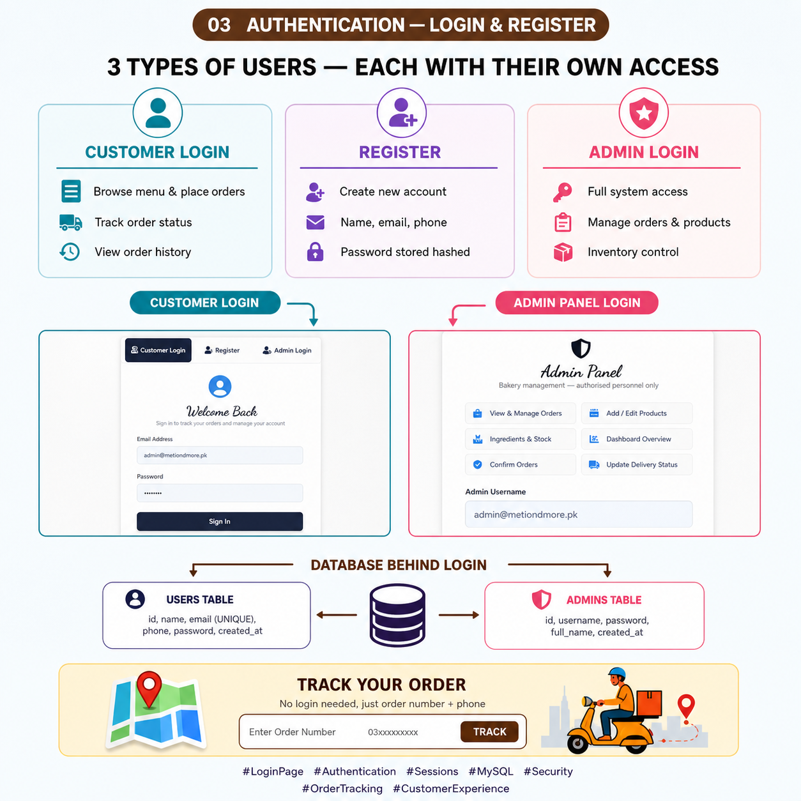
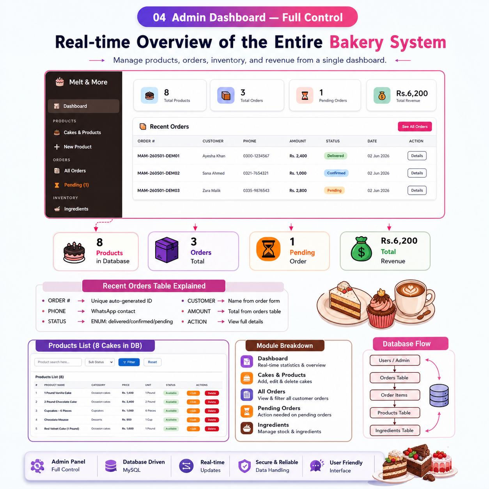
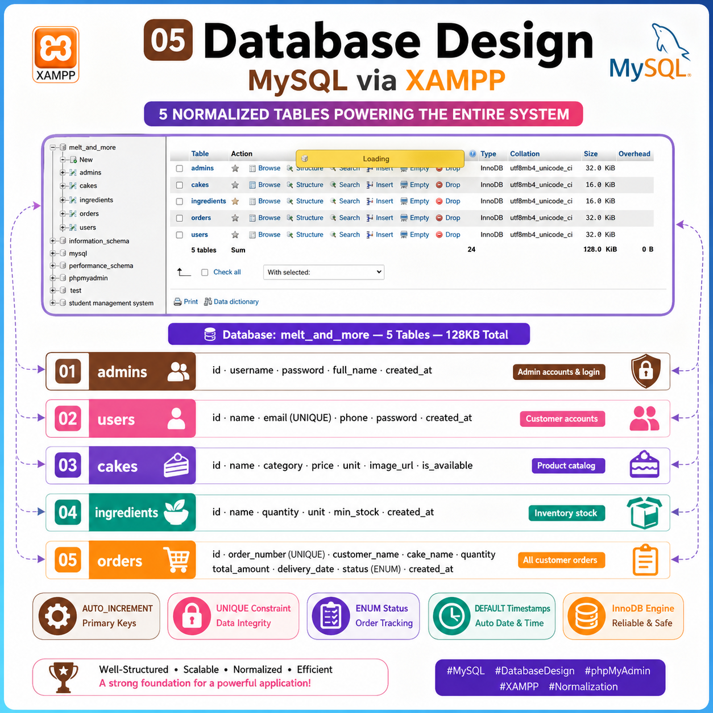
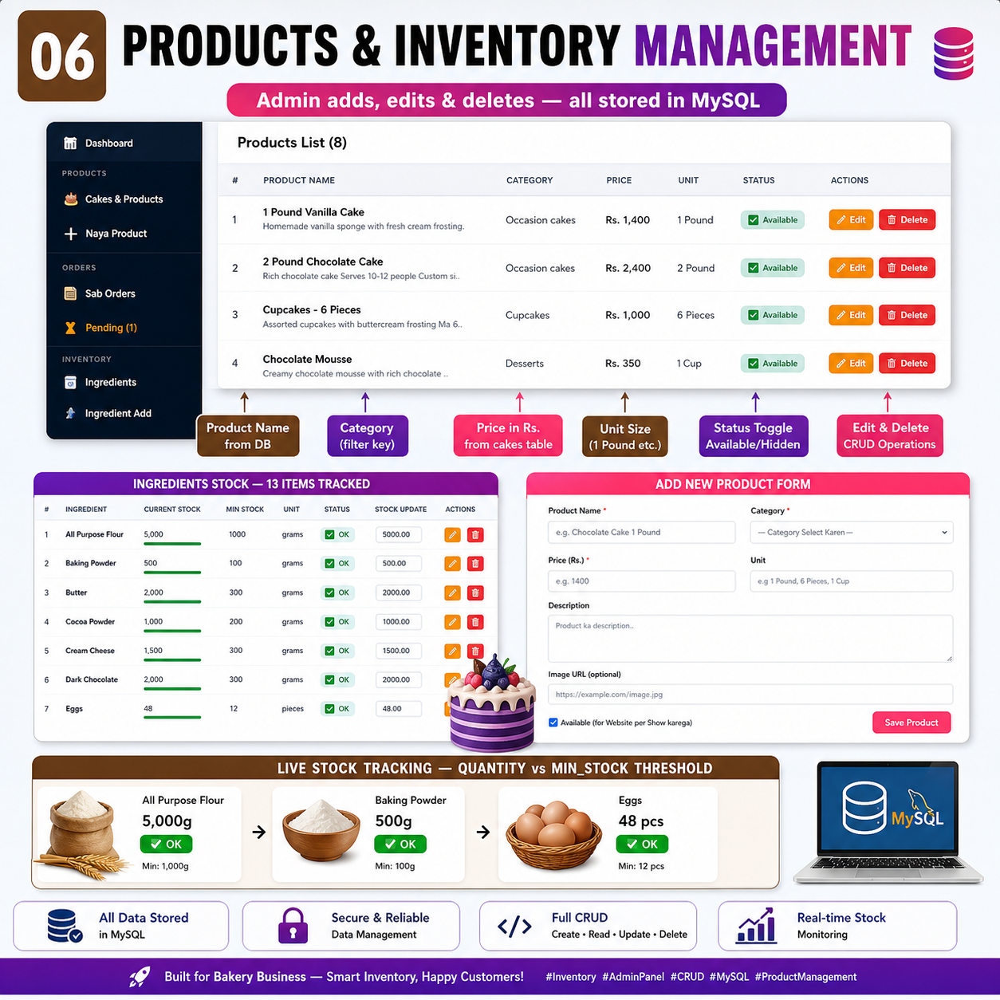

# Melt&More-Database-Project
# Melt & More — Where every heart melts
## Online Order Management System

**Subject:** Database Management Systems (DBMS)  
**Semester:** 4th Semester — BS Artificial Intelligence  
**University:** Riphah International University, Sahiwal  
**Program:** BSAI-A

---

## Developers

| Name | ID |
|------|----|
| Malayika Tahir | F24-BSAI-0009 |
| Mahnoor Ali Bahadur | F24-BSAI-0010 |

---

## Project Overview



Melt & More Sweet Bakery is a Database Management System designed to digitize and automate bakery operations. It replaces manual chats and diaries with a centralized system to manage orders, customers, products, and sales efficiently and accurately.

---

## The Real Problem — Before the System



Before this system, Malayika managed her bakery manually across four platforms simultaneously — TikTok, Instagram, YouTube, and WhatsApp — with no central record.

| # | Problem | Impact |
|---|---------|--------|
| 01 | Orders received on 4 platforms with no central record | Orders were getting lost |
| 02 | Advance payments written in notebooks | Customers denied paying — revenue lost |
| 03 | No inventory system — ingredients ran out before delivery | No alerts, no minimum-stock warnings |
| 04 | No order history maintained | Repeat customers had to explain preferences every time |

---

## System Features

### 01 — Customer Website Homepage



The customer-facing homepage provides a complete browsing and ordering experience.

| Section | Description |
|---------|-------------|
| Welcome Hero | Homepage with cake gallery and call-to-action buttons |
| Navigation | Home, Menu, About Us, Contact, My Account |
| Order Now Button | Direct link to ordering form — one click to place order |
| View Menu Button | Browse all cakes by category with prices |

**Brand Values:**

| Tradition | Quality | Creativity | Passion |
|-----------|---------|------------|---------|
| Every cake follows time-honoured homemade recipes | Premium-grade ingredients only — no artificial flavours | Every order is unique with custom designs and decorations | Every piece carries genuine care and dedication |

---

### 02 — Dynamic Menu with Categories, Prices and Ordering



The menu page pulls live data from the MySQL `cakes` table and allows customers to filter by category and place orders directly.

**Sample Products:**

| Product | Category | Price |
|---------|----------|-------|
| 1 Pound Vanilla Cake | Occasion Cakes | Rs. 1,400 |
| 2 Pound Chocolate Cake | Occasion Cakes | Rs. 2,400 |
| Cupcakes — 6 Pieces | Cupcakes | Rs. 1,000 |
| Chocolate Mousse | Desserts | Rs. 350 |
| Red Velvet Cake | Occasion Cakes | Rs. 1,600 |

**Order Status Flow:**

```
Pending  -->  Confirmed  -->  Preparing  -->  Delivered  -->  Cancelled
```

Customers can track their order using the auto-generated Order Number (format: MM-YYYY-XXXX) and their phone number — no login required.

---

### 03 — Authentication — Login and Register



The system supports three types of users, each with separate access levels.

| User Type | Capabilities |
|-----------|-------------|
| Customer Login | Browse menu, place orders, track order status, view order history |
| Register | Create new account with name, email, phone — password stored hashed |
| Admin Login | Full system access — manage orders, products, inventory |

**Database tables behind authentication:**

- `users` — id, name, email (UNIQUE), phone, password, created_at  
- `admins` — id, username, password, full_name, created_at

---

### 04 — Admin Dashboard



The admin dashboard provides a real-time overview of the entire bakery system from a single interface.

**Dashboard Summary (Sample Data):**

| Total Products | Total Orders | Pending Orders | Total Revenue |
|---------------|-------------|----------------|--------------|
| 8 | 3 | 1 | Rs. 6,200 |

**Module Breakdown:**

| Module | Function |
|--------|----------|
| Dashboard | Real-time statistics and overview |
| Cakes and Products | Add, edit and delete products |
| All Orders | View and filter all customer orders |
| Pending Orders | Action required on unconfirmed orders |
| Ingredients | Manage stock levels |

---

### 05 — Database Design



---

### 06 — Products and Inventory Management



The admin can add, edit, and delete products with full CRUD operations. Ingredient stock is tracked live against minimum thresholds.

**Sample Ingredient Tracking:**

| Ingredient | Current Stock | Minimum Stock | Status |
|-----------|--------------|---------------|--------|
| All Purpose Flour | 5,000 g | 1,000 g | OK |
| Baking Powder | 500 g | 100 g | OK |
| Butter | 2,000 g | 300 g | OK |
| Cocoa Powder | 1,000 g | 200 g | OK |
| Eggs | 48 pcs | 12 pcs | OK |

---

## Database Design

**Database name:** `melt_and_more`  
**Engine:** MySQL via XAMPP  
**Tables:** 5 normalized tables — 128 KB total

```sql
-- 01. admins
CREATE TABLE admins (
    id          INT AUTO_INCREMENT PRIMARY KEY,
    username    VARCHAR(100) UNIQUE NOT NULL,
    password    VARCHAR(255) NOT NULL,
    full_name   VARCHAR(100),
    created_at  TIMESTAMP DEFAULT CURRENT_TIMESTAMP
);

-- 02. users
CREATE TABLE users (
    id          INT AUTO_INCREMENT PRIMARY KEY,
    name        VARCHAR(100) NOT NULL,
    email       VARCHAR(100) UNIQUE NOT NULL,
    phone       VARCHAR(20),
    password    VARCHAR(255) NOT NULL,
    created_at  TIMESTAMP DEFAULT CURRENT_TIMESTAMP
);

-- 03. cakes
CREATE TABLE cakes (
    id           INT AUTO_INCREMENT PRIMARY KEY,
    name         VARCHAR(100) NOT NULL,
    category     VARCHAR(50),
    price        DECIMAL(10,2) NOT NULL,
    unit         VARCHAR(30),
    image_url    VARCHAR(255),
    is_available TINYINT(1) DEFAULT 1
);

-- 04. ingredients
CREATE TABLE ingredients (
    id          INT AUTO_INCREMENT PRIMARY KEY,
    name        VARCHAR(100) NOT NULL,
    quantity    DECIMAL(10,2) DEFAULT 0,
    unit        VARCHAR(20),
    min_stock   DECIMAL(10,2) DEFAULT 0,
    created_at  TIMESTAMP DEFAULT CURRENT_TIMESTAMP
);

-- 05. orders
CREATE TABLE orders (
    id             INT AUTO_INCREMENT PRIMARY KEY,
    order_number   VARCHAR(30) UNIQUE NOT NULL,
    customer_name  VARCHAR(100) NOT NULL,
    cake_name      VARCHAR(100) NOT NULL,
    quantity       INT NOT NULL,
    total_amount   DECIMAL(10,2),
    delivery_date  DATE,
    status         ENUM('Pending','Confirmed','Preparing','Delivered','Cancelled')
                   DEFAULT 'Pending',
    created_at     TIMESTAMP DEFAULT CURRENT_TIMESTAMP
);
```

**Database features implemented:**

| Feature | Purpose |
|---------|---------|
| AUTO_INCREMENT Primary Keys | Unique row identification |
| UNIQUE Constraint | Data integrity on email and order number |
| ENUM Status | Controlled order tracking values |
| DEFAULT Timestamps | Automatic date and time recording |
| InnoDB Engine | Reliable and transaction-safe storage |

---

## Tech Stack

| Layer | Technology |
|-------|-----------|
| Frontend / Desktop UI | Java — NetBeans IDE (Drag and Drop GUI) |
| Database | MySQL via XAMPP / phpMyAdmin |
| DB Connection | JDBC (Java Database Connectivity) |
| Backend Logic | Java classes and SQL queries |
| Web Interface | PHP, HTML, CSS, JavaScript |

---

## Key Outcomes

- Centralized order management across all platforms
- Payment tracking with complete records
- Real-time inventory alerts when stock falls below minimum
- Complete customer order history
- Monthly revenue reporting
- Admin dashboard with full CRUD operations

---

## About the Bakery

Melt & More is a real home-based bakery operating in Sahiwal, Punjab. It accepts custom cake and dessert orders through TikTok, Instagram, YouTube, and WhatsApp under the handle `@meltandmoresahiwal`. This system was built to solve real operational problems faced by the business.

---

**Riphah International University, Sahiwal**  
BS Artificial Intelligence — 4th Semester  
Database Management Systems — Course Project  
Developers: Malayika Tahir and Mahnoor Ali Bahadur
